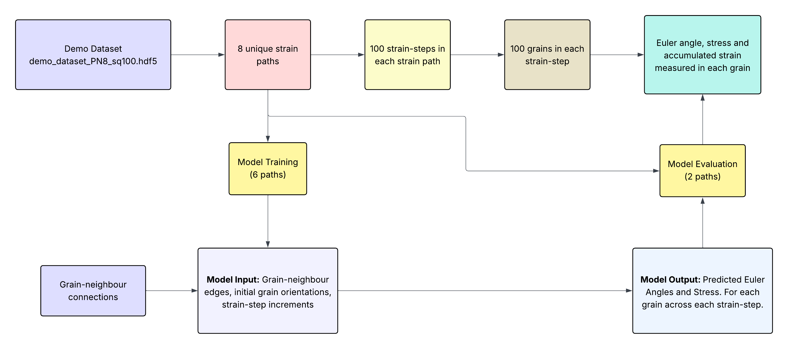

# Graph Neural Networks for grain tracking in crystal plasticity simulations

This file defines the full **data preparation and training pipeline** for graph-based learning using the model and demo dataset from Hu et al. (2024).

Each dataset sample corresponds to **one strain path**, where grains in a representative volume element (RVE) are modeled as nodes in a graph and trained to predict grain-scale responses over strain increments.

## Overview

The code provides functionality to:

- Construct **graph data objects** representing grain connectivity using demo_dataset_PN8_sq100.hdf5 and edge network (RVE24-n100_edge_feature.pickle)
- Create PyG 'DataLoader's for training and testing.
- Perform **model training and evaluation**

---

# experimental-data-gnn\create_pyg_graph.ipynb

This file defines the full **data processing** for graph-based learning using experimental grain neighbour, shear, orientation, size and phase data.

## Overview

The code provides functionality to:

- Extract **grain neighbour** data
- Normalise variables
- Construct **graph data objects**

---

# experimental-data-gnn\gnn_single_step.ipynb
This file defines the full **model training and evaluation pipeline** for graph-based learning using experimental grain neighbour, shear, orientation, size and phase data.

## Overview

The code provides functionality to:

- Create PyG 'DataLoader's for training and testing.
- Perform **model training and evaluation**

---

# GNN for Grain Track

Graph neural network (GNN) workflows for modeling grain-scale responses using
both a demo dataset from Hu et al. (2024) and experimental grain neighborhood
measurements. The repository is primarily notebook-driven and includes data
artifacts required to construct PyTorch Geometric graphs, train models, and
analyze predicted responses across strain increments.

## Repository layout

- `TGNN/`
  - `tgnn_model.ipynb`: end-to-end demo data pipeline (data preparation,
    training, and evaluation).
  - `read_hdf5_data.ipynb`: helper notebook for inspecting the HDF5 dataset.
  - `demo_dataset_PN8_sq100.hdf5`: demo dataset used by the TGNN workflow.
  - `RVE24-n100_edge_feature.pickle`: precomputed edge features for the demo
    dataset.
- `experimental-data-gnn/`
  - `create_pyg_graph.ipynb`: preprocess experimental grain data, normalize
    variables, and build PyG graph objects.
  - `gnn_single_step.ipynb`: train and evaluate a GNN on the experimental
    graphs.
  - `requirements.txt`: Python dependencies for the experimental workflow.
  - `grain_data_*.pt`, `gnn_model_*.pth`, `strain_grains.pkl`: preprocessed
    tensors, model checkpoints, and strain data used by the notebooks.
  - `filtered_initial_grains/`, `zmatch/`: supporting data folders referenced
    by the experimental notebooks.
- `2D_10%strain_100grains/`: result folders for multiple loading scenarios
  (compression/tension along different axes).

## Workflows

### 1. Demo TGNN workflow (Hu et al. 2024 data)

1. Open `TGNN/read_hdf5_data.ipynb` to inspect the HDF5 dataset structure.
2. Run `TGNN/tgnn_model.ipynb` to:
   - Construct PyG graph objects from `demo_dataset_PN8_sq100.hdf5` and
     `RVE24-n100_edge_feature.pickle`.
   - Create PyG dataloaders for training/testing splits.
   - Train and evaluate the graph model across strain increments.



### 2. Experimental data workflow

1. Install dependencies listed in `experimental-data-gnn/requirements.txt`.
2. Run `experimental-data-gnn/create_pyg_graph.ipynb` to:
   - Load grain neighborhood, shear, orientation, size, and phase data.
   - Normalize features and build PyG graph data objects.
3. Run `experimental-data-gnn/gnn_single_step.ipynb` to:
   - Create dataloaders.
   - Train and evaluate the single-step GNN model.


## Environment setup

The experimental workflow includes a minimal requirements file. Example setup:

```bash
python -m venv .venv
source .venv/bin/activate
pip install -r experimental-data-gnn/requirements.txt
```

For GPU acceleration, install a compatible PyTorch build and the matching
PyTorch Geometric wheels. Refer to the PyTorch and PyG installation guides for
your CUDA version.

